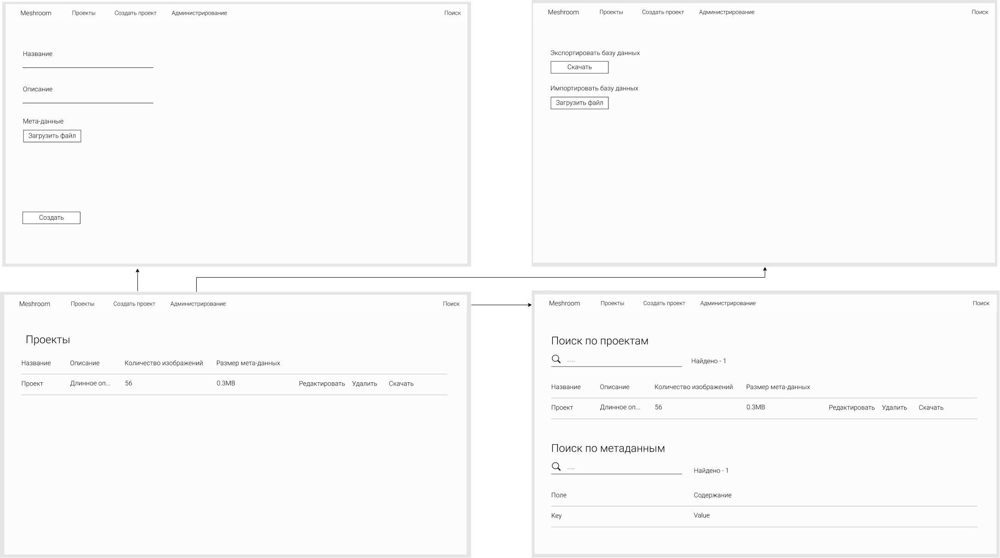

# nosql2h21-meshrooom

## Use cases

### Макет


### Модель данных

[Модель данных](модель%20данных.pdf)

### Запуск проекта

```
docker-compose up -d --force
```

После запуска backend будет доступен по адресу http://0.0.0.0