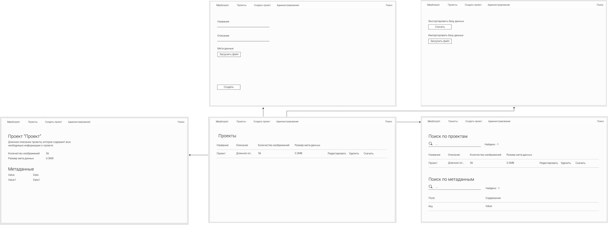

# nosql2h21-meshrooom

## Use cases

### Макет


### Модель данных

[Модель данных](модель%20данных.pdf)

### Endpoints

GET /projects - Получить список проектов

GET /project/{id} - Получить проект

POST /projects - Создать проект

DELETE /projects/{id} - Удалить проект

POST /project/{id}/edit - Отредактировать проект

POST /projects/search - Поиск по проектам

POST /metadata/search - Поиск по метаданным

### Запуск проекта

```
docker-compose up -d --force
cd frontend
npm start
```

Проект доступен по адресу http://localhost:3000


### Пример метаданных проекта Meshroom

```
{
    "newmtl": "TextureAtlas_1001",
    "Ka": {
        0.6,
        0.6,
        0.6
    },
    "Kd": {
        0.6,
        0.6,
        0.6
    },
    "Ks": {
        0.0,
        0.0,
        0.0
    },
    "d": 1.0,
    "Ns": 0.0,
    "illum": 2,
    "map_Kd": "texture_1001.png",
    "newmtl": "TextureAtlas_1002",
    "Ka": {
        0.6,
        0.6,
        0.6
    },
    "Kd": {
        0.6,
        0.6,
        0.6
    },
    "Ks": {
        0.0,
        0.0,
        0.0
    },
    "d": 1.0,
    "Ns": 0.0,
    "illum": 2,
    ....
}
```